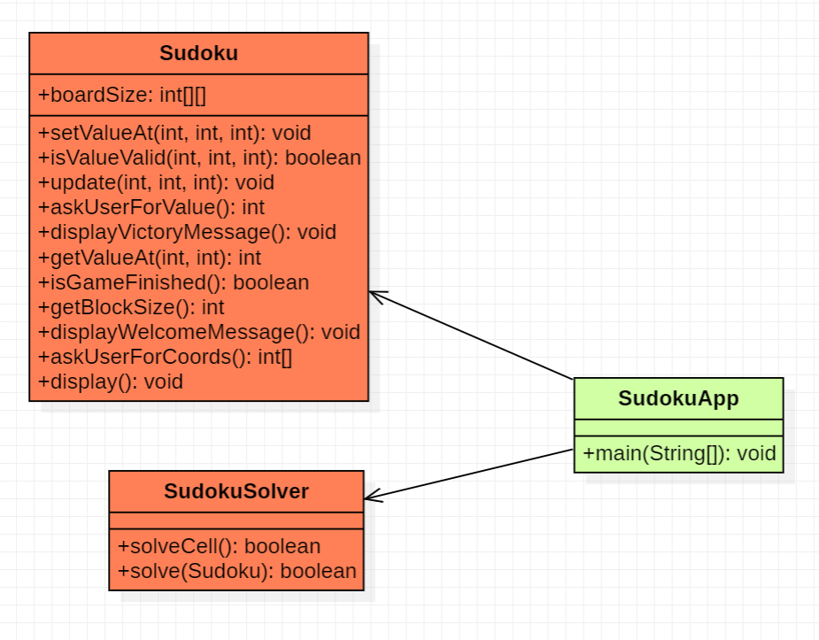

# TD4 : Patron MVC

### Exercice 1
##### Diagramme de classes (solution AntiPattern):

### Question 2

#### Principes SOLID: 
- S : La classe Sudoku gère plusieurs responsabilités (validation des valeurs, mise à jour de la grille, affichage, gestion des entrées utilisateur et affichage des messages) alors qu'elle devrait déléguer ces responsabilités à des classes ou des composants distincts.
- O : La méthode isValueValid() de la classe Sudoku devrait être modifiée pour inclure de nouvelles règles de validation. 
De même, la classe SudokuSolver pourrait également nécessiter des modifications si la logique de résolution devait être changée.
- D : La classe SudokuApp dépend directement de la classe Sudoku et de la classe SudokuSolver, qui sont des implémentations concrètes. 
Selon le "Dependency Inversion Principle", les classes devraient dépendre d'abstractions plutôt que d'implémentations concrètes.

### Question 3
Le modèle MVC peut aider en séparant les responsabilités de l'application et en permettant une meilleure organisation du code.

### Question 4
L'utilisation du modèle MVC offre plusieurs avantages :
- Séparer les responsabilités : divise les responsabilités entre le modèle, la vue et le contrôleur.
- Testabilité : La sépération des tâches permet de tester les différentes parties de l'application de manière indépendante.
- Réutilisabilité : Les composants du MVC peuvent être réutilisés pour d'autres parties de l'application.
- Extensibilité : Il devient plus facile de faire évoluer l'application.
- Flexibilité : On peut facilement remplacer des composants sans affecter les autres.
- Bonnes pratiques de programmation : Encourage à l'utilisation des principes SOLID.

### Question 5
- Statégie : On peut utiliser le pattern stratégie pour implémenter différentes techniques de résolution ou de génération de grilles.
- Observateur : On peut utiliser le pattern observateur pour mettre à jour la vue lorsqu'une valeur est modifiée dans le modèle.
- Composite : utilisé pour gérer les différentes parties de l'interface graphique (blocs, lignes et colonnes de la grille) et les traiter de manière unifiée. 
Cela simplifie également la gestion de l'interface et permet plus de modularité.
- Commande : Gérer les actions de l'utilisateur (remplir une case, annuler ou refaire une action) de manière structurée et indépendante du reste du code. 
Facilite l'ajout de nouvelles fonctionnalités, comme l'implémentation d'un système d'annulation et améliore la modularité du code.

### Question 6
La solution antipattern ne respecte pas les principes SOLID.

### Question 7

On pourrait diviser le Sudoku en trois parties distinctes en suivant le patron de conception Modèle-Vue-Contrôleur. 
Le modèle représenterait les données et la logique du jeu et serait responsable de notifier les observateurs lorsqu'il y a un changement dans les données. 
La vue assurerait la présentation du jeu en s'actualisant en fonction des changements dans le modèle grâce au patron Observateur. 
Enfin, le contrôleur pourrait gérer les événements utilisateur, interagir avec le modèle et la vue pour mettre à jour l'état du jeu, et coordonner les interactions entre le modèle et la vue.

### Question 8
Pour appliquer le patron Observateur dans le jeu de Sudoku, on crée un lien entre le modèle et la vue, de manière à ce que la vue soit informée des modifications dans le modèle. 
Pour cela, le modèle (SudokuModel) doit avoir une liste d'observateurs et des méthodes pour ajouter (registerObserver) et informer (notifyObservers) ces observateurs lorsqu'il y a une modification des données.
La vue (SudokuView) doit mettre en œuvre l'interface SudokuObserver, qui définit la méthode update. Cette méthode est appelée par le modèle lorsqu'il y a une modification des données. 
Donc, chaque fois qu'une mise à jour a lieu dans le modèle, la méthode update est appelée sur chaque observateur enregistré, et la vue se met à jour en conséquence.

### Question 9
Pour appliquer le patron Stratégie dans la résolution du Sudoku, on crée une interface SudokuSolverStrategy qui définit la méthode de résolution générale comme solve(SudokuModel). 
Cette interface sera implémentée par différentes classes concrètes représentant les algorithmes de résolution spécifiques, tels que BacktrackingSolver.
Ensuite, dans le modèle ou le contrôleur, on utilise une référence de type SudokuSolver pour interagir avec l'algorithme de résolution. 
Pendant la création de l'instance du modèle ou du contrôleur, on peut choisir l'implémentation de l'algorithme de résolution en fonction des besoins.

### Question 10
Pour utiliser le patron Commande dans le jeu de Sudoku, on crée une classe SudokuCommand avec des méthodes pour exécuter et annuler les actions. 
On crée ensuite des classes spécifiques pour chaque action avec une classe SetValueCommand pour modifier une valeur dans le modèle.
Le contrôleur utilise ces commandes pour gérer les actions des utilisateurs. 
Lorsqu'une action est réalisée, le contrôleur exécute la commande correspondante. 
Pour annuler ou rétablir une action, le contrôleur utilise la méthode undo() de la commande appropriée.

### Question 11
On peut se servir du pattern Composite pour construire la vue du Sudoku à partir de multiples SudokuCellView.
Pour cela nous pouvons modifier la classe SudokuView pour lui ajouter un tableau de SudokuCellView et mettre à jour ces objets lors de l'appel de la méthode update().

### Question 12
Pour que le jeu de Sudoku fonctionne, il faudrait créer une interface graphique pour afficher la grille de jeu et permettre à l'utilisateur de saisir des chiffres. 
Il faudrait également créer une classe pour le modèle de Sudoku qui contient les données du jeu et les méthodes pour accéder et modifier les valeurs de la grille. 
Ensuite, il faudrait relier l'interface utilisateur à la classe de modèle pour permettre à l'utilisateur de jouer et mettre à jour la grille. 
Enfin, il faudrait ajouter une méthode pour vérifier si le jeu est terminé en vérifiant si toutes les cases sont remplies correctement.

