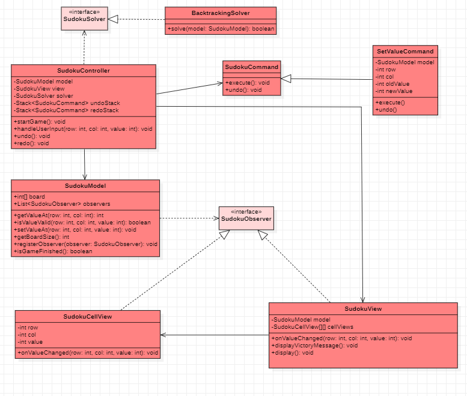

# TD4 : Patron MVC

### Question 1
##### Diagramme de classes (solution AntiPattern):

### Question 2

#### Principes SOLID: 
- S : La classe Sudoku gère plusieurs responsabilités (validation des valeurs, mise à jour de la grille, affichage, gestion des entrées utilisateur et affichage des messages) alors qu'elle devrait déléguer ces responsabilités à des classes ou des composants distincts.
- O : La méthode isValueValid() de la classe Sudoku devrait être modifiée pour inclure de nouvelles règles de validation. 
De même, la classe SudokuSolver pourrait également nécessiter des modifications si la logique de résolution devait être changée.
- D : La classe SudokuApp dépend directement de la classe Sudoku et de la classe SudokuSolver, qui sont des implémentations concrètes. 
Selon le "Dependency Inversion Principle", les classes devraient dépendre d'abstractions plutôt que d'implémentations concrètes.

### Question 3
Le modèle MVC peut aider en séparant les responsabilités de l'application et en permettant une meilleure organisation du code.

### Question 4
L'utilisation du modèle MVC offre plusieurs avantages :
- Divise les responsabilités entre le modèle, la vue et le contrôleur.
- La sépération des tâches permet de tester les différentes parties de l'application de manière indépendante.
- Les composants du MVC peuvent être réutilisés pour d'autres parties de l'application.
- Rend l'évolution de l'application plus simple.
- Permet de remplacer facilement des composants sans affecter les autres.
- Encourage à l'utilisation des principes SOLID.

### Question 5
- Statégie : On peut utiliser le pattern stratégie pour implémenter différentes techniques de résolution ou de génération de grilles.
- Observateur : On peut utiliser le pattern observateur pour mettre à jour la vue lorsqu'une valeur est modifiée dans le modèle.
- Composite : utilisé pour gérer les différentes parties de l'interface graphique (blocs, lignes et colonnes de la grille) et les traiter de manière unifiée. 
Cela simplifie également la gestion de l'interface et permet plus de modularité.
- Commande : Gérer les actions de l'utilisateur (remplir une case, annuler ou refaire une action) de manière structurée et indépendante du reste du code. 
Facilite l'ajout de nouvelles fonctionnalités, comme l'implémentation d'un système d'annulation et améliore la modularité du code.

### Question 6
La classe Sudoku contient à la fois des méthodes pour résoudre le Sudoku (par exemple, isValueValid() et setValueAt()) et des méthodes pour afficher et interagir avec l'utilisateur (par exemple, display() et askUserForValue()). 
Cette classe ne respecte pas le principe de responsabilité unique (SRP) et est donc difficile à maintenir et à tester.

### Question 7
Pour diviser la solution en trois parties distinctes, nous allons créer trois classes : SudokuModel pour le modèle, SudokuView pour la vue et SudokuController pour le contrôleur. 
Le modèle contiendra les données du jeu, la vue gérera l'affichage et le contrôleur s'occupera des événements utilisateur.

### Question 8
Pour appliquer le patron Observateur, nous ferons en sorte que la classe SudokuModel hérite de l'interface SudokuObserver et qu'elle notifie tous les observateurs (SudokuCellView) lorsqu'une valeur change. 
La classe SudokuView deviendra également un observateur et mettra à jour l'affichage en fonction des changements dans le modèle.

### Question 9
Pour appliquer le patron Stratégie, nous créerons une interface SudokuSolver que les différentes classes d'algorithmes de résolution du Sudoku implémenteront. 
Le modèle utilisera cette interface pour résoudre le Sudoku, permettant de changer facilement l'algorithme de résolution sans impacter le reste du code.

### Question 10
Pour appliquer le patron Commande, nous créerons une classe abstraite SudokuCommand avec les méthodes execute() et undo(). 
Les classes de commandes spécifiques (par exemple SetValueCommand) hériteront de cette classe et permettront au contrôleur de modifier le modèle de manière encapsulée.

### Question 11
Pour appliquer le patron Composition, nous construirons la vue du Sudoku à partir de plusieurs instances de SudokuCellView. 
Chaque cellule sera responsable de l'affichage de son contenu et la classe SudokuView se chargera de la gestion globale de l'affichage.

### Question 12
Pour relier toutes les parties entre elles, nous établirons des liens entre les classes. 
Le contrôleur utilisera le modèle et la vue, la vue observera le modèle et se mettra à jour en conséquence, et les différentes stratégies de résolution et commandes seront utilisées par le contrôleur et le modèle.

### Question 13
##### Diagramme de classes (solution MVC):

### Questions 14 à 25 : Partie JAVA

Voir le code source dans le dossier [src](src).